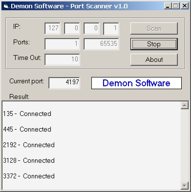



## Port Scanner v1\.0 from Demon Software

### Description

Help the people to view what work this applicationa and winsock's
 
### More Info
 

             |
---                |---
**Submitted On**   |2002-08-15 12:08:08
**By**             |[Ivan Ivanov Blagoev](https://github.com/Planet-Source-Code/PSCIndex/blob/master/ByAuthor/ivan-ivanov-blagoev.md)
**Level**          |Intermediate
**User Rating**    |4.7 (14 globes from 3 users)
**Compatibility**  |VB 6\.0
**Category**       |[Complete Applications](https://github.com/Planet-Source-Code/PSCIndex/blob/master/ByCategory/complete-applications__1-27.md)
**World**          |[Visual Basic](https://github.com/Planet-Source-Code/PSCIndex/blob/master/ByWorld/visual-basic.md)
**Archive File**   |[Port\_Scann1183828152002\.zip](https://github.com/Planet-Source-Code/ivan-ivanov-blagoev-port-scanner-v1-0-from-demon-software__1-37964/archive/master.zip)

### API Declarations

None, winsock only

